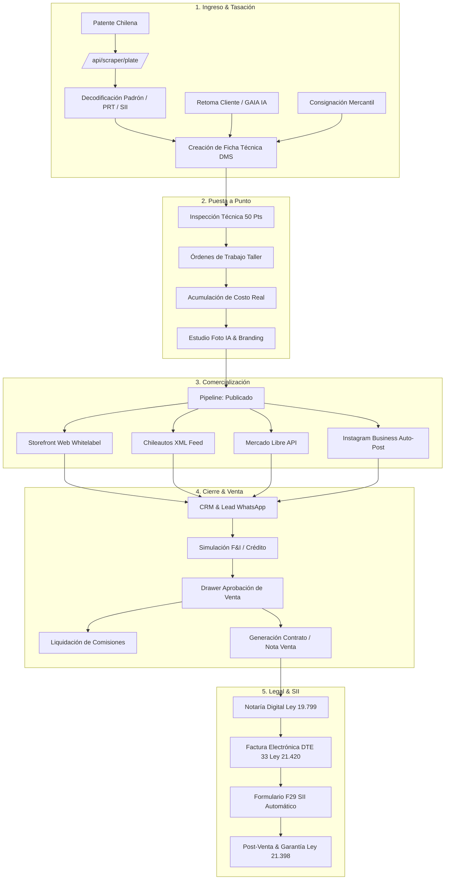
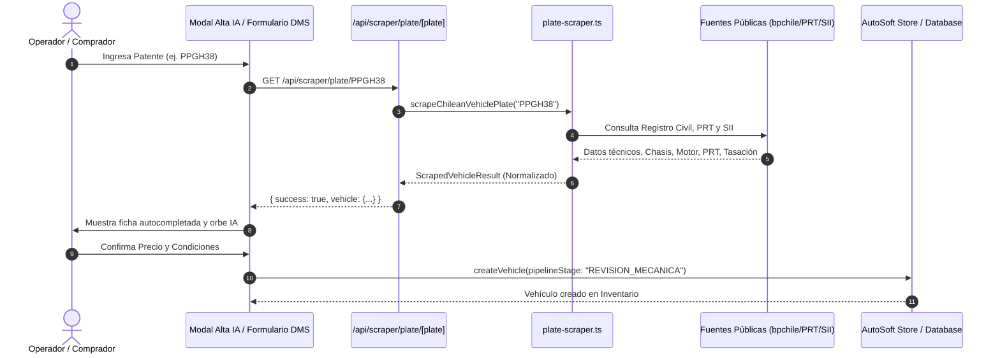
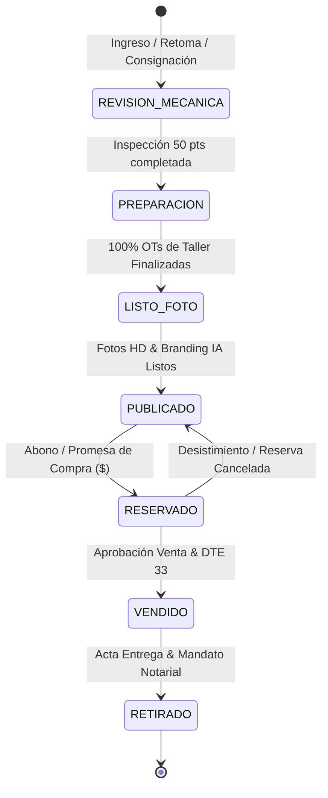
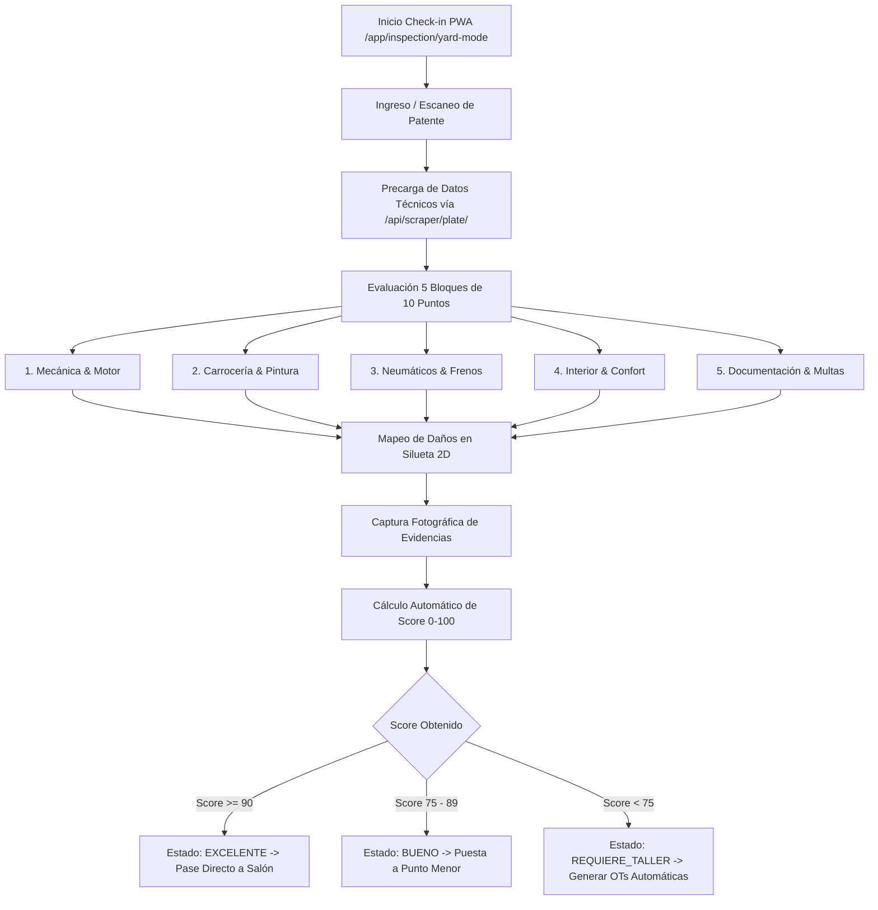
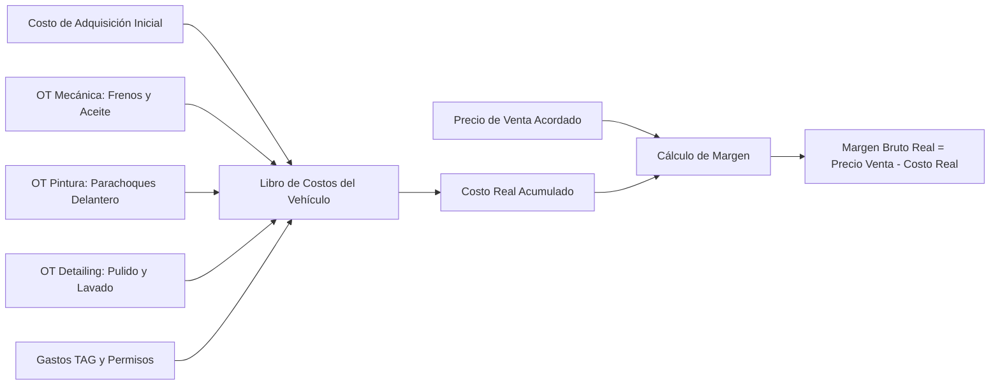
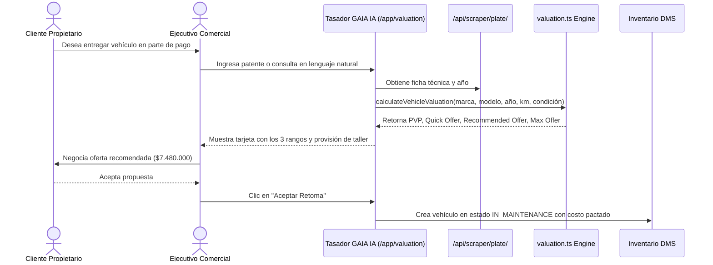
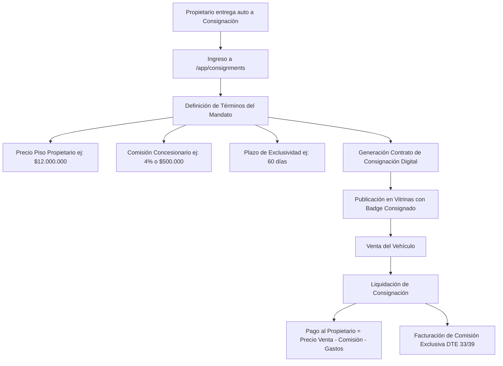
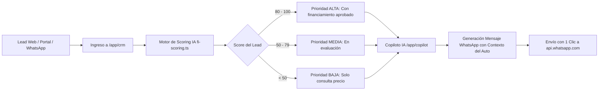
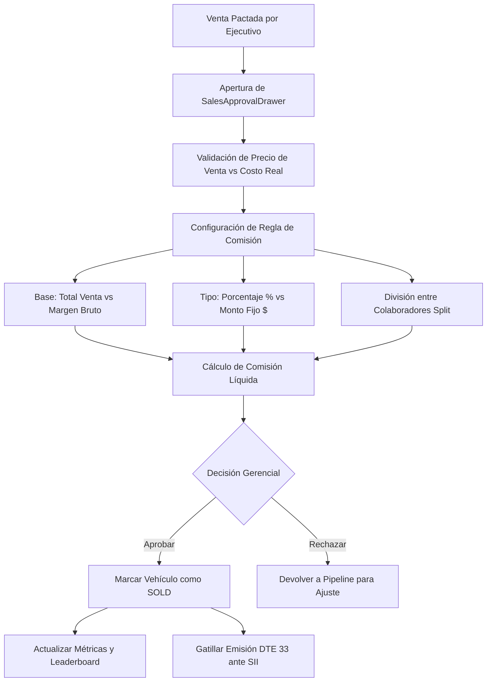
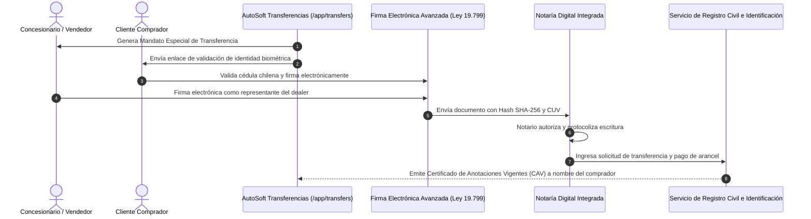

# 📘 Manual Integral de Procesos Operativos, Comerciales y Tributarios: AutoSoft 360

## Sistema Operativo Integral para Concesionarios y Compraventas de Vehículos en Chile (v2.0)

---

## 📑 Tabla de Contenidos

1. [Arquitectura General y Mapa de Procesos](#1-arquitectura-general-y-mapa-de-procesos)
2. [Proceso 1: Ingesta y Pre-ingreso Asistido de Vehículos con Scraper de Patentes](#proceso-1-ingesta-y-pre-ingreso-asistido-de-vehículos-con-scraper-de-patentes)
3. [Proceso 2: Pipeline Operativo de 7 Etapas del Vehículo](#proceso-2-pipeline-operativo-de-7-etapas-del-vehículo)
4. [Proceso 3: Check-in en Terreno e Inspección Técnica de 50 Puntos](#proceso-3-check-in-en-terreno-e-inspección-técnica-de-50-puntos)
5. [Proceso 4: Taller, Reacondicionamiento y Acumulación de Costo Real](#proceso-4-taller-reacondicionamiento-y-acumulación-de-costo-real)
6. [Proceso 5: Tasación Predictiva de Retomas y Asistente Conversacional GAIA IA](#proceso-5-tasación-predictiva-de-retomas-y-asistente-conversacional-gaia-ia)
7. [Proceso 6: Consignaciones y Gestión de Mandatos Mercantiles](#proceso-6-consignaciones-y-gestión-de-mandatos-mercantiles)
8. [Proceso 7: CRM Automotriz, Scoring de Leads y WhatsApp Copilot](#proceso-7-crm-automotriz-scoring-de-leads-y-whatsapp-copilot)
9. [Proceso 8: Simulación F&I y Crédito Automotriz Multifinanciera](#proceso-8-simulación-fi-y-crédito-automotriz-multifinanciera)
10. [Proceso 9: Cotización de Seguros y Garantías Mecánicas (Ley 21.398)](#proceso-9-cotización-de-seguros-y-garantías-mecánicas-ley-21398)
11. [Proceso 10: Generador de Documentos y Contratos Chilenos](#proceso-10-generador-de-documentos-y-contratos-chilenos)
12. [Proceso 11: Aprobación de Ventas y Liquidación de Comisiones](#proceso-11-aprobación-de-ventas-y-liquidación-de-comisiones)
13. [Proceso 12: Facturación DTE 33 con Régimen IVA Margen (Ley 21.420)](#proceso-12-facturación-dte-33-con-régimen-iva-margen-ley-21420)
14. [Proceso 13: Determinación Contable y Liquidación Formulario F29 SII](#proceso-13-determinación-contable-y-liquidación-formulario-f29-sii)
15. [Proceso 14: Transferencia Digital Notarial y Registro Civil (Ley 19.799)](#proceso-14-transferencia-digital-notarial-y-registro-civil-ley-19799)
16. [Proceso 15: Estudio Fotográfico IA y Publicador Instagram Business](#proceso-15-estudio-fotográfico-ia-y-publicador-instagram-business)
17. [Proceso 16: Sindicación Multicanal (Chileautos, Mercado Libre, Yapo)](#proceso-16-sindicación-multicanal-chileautos-mercado-libre-yapo)
18. [Proceso 17: Red Mayorista B2B y Subastas de Concesionarios](#proceso-17-red-mayorista-b2b-y-subastas-de-concesionarios)
19. [Proceso 18: Tareas Operativas Vinculadas a Patente (Kanban)](#proceso-18-tareas-operativas-vinculadas-a-patente-kanban)
20. [Proceso 19: Panel Ejecutivo Multidimensional y Analítica P&L](#proceso-19-panel-ejecutivo-multidimensional-y-analítica-pl)
21. [Proceso 20: Storefront Web Whitelabel y Pasarela Webpay Plus](#proceso-20-storefront-web-whitelabel-y-pasarela-webpay-plus)
22. [Proceso 21: Post-Venta, Fidelización y Alertas de Mantenimiento](#proceso-21-post-venta-fidelización-y-alertas-de-mantenimiento)
23. [Proceso 22: Auditoría Forense, Seguridad y Registro de Trazabilidad](#proceso-22-auditoría-forense-seguridad-y-registro-de-trazabilidad)
24. [Proceso 23: Onboarding y Configuración Multi-Tenant](#proceso-23-onboarding-y-configuración-multi-tenant)
25. [Proceso 24: Suscripción SaaS en UF y Pagos Recurrentes](#proceso-24-suscripción-saas-en-uf-y-pagos-recurrentes)

---

## 1. Arquitectura General y Mapa de Procesos

AutoSoft 360 opera como el sistema operativo central (DMS + CRM + ERP + Compliance) para compraventas y concesionarios en Chile. Cada acción dentro de la plataforma interconecta el catálogo físico del patio con la normativa tributaria del SII, la notaría digital y los canales de venta en línea.

---

## Proceso 1: Ingesta y Pre-ingreso Asistido de Vehículos con Scraper de Patentes

### 🎯 Objetivo
Eliminar el error humano y acelerar en más de un 90% el tiempo de ingreso de una unidad al stock, obteniendo automáticamente las especificaciones oficiales, histórico técnico y avalúo fiscal a partir de las 6 letras/números de la placa patente única (PPU).

### 👥 Roles Intervinientes
* **Encargado de Adquisiciones / Comprador**
* **Jefe de Patio / Recepcionista**
* **Sistema:** API Scraper unificada (`/api/scraper/plate/[plate]`)

### 📥 Entradas (Inputs)
* Patente chilena (ej. `PPGH38`, `BBCL12`, `AB1234`).

### 🔄 Diagrama de Flujo

### 📋 Paso a Paso
1. **Acceso al Módulo:** El usuario ingresa a `/app/inventory` y presiona el botón **`✨ Alta con IA`** (o navega a `/app/inventory/new`).
2. **Ingreso de Patente:** Tipea la patente chilena. La plataforma normaliza la entrada convirtiendo a mayúsculas y eliminando caracteres especiales (puntos, guiones y espacios).
3. **Consulta de Fuentes Centralizadas:** El endpoint `/api/scraper/plate/[plate]` ejecuta en milisegundos:
   - Identificación de formato: Nuevo (4 consonantes + 2 dígitos) o Antiguo (2 letras + 4 dígitos).
   - Consulta a bases de datos de Registro Civil y Padrón Digital (CAV).
   - Extracción de número de chasis (VIN) y número de motor.
   - Consulta de estado de Revisión Técnica (PRT) y fecha de vencimiento de gases.
   - Consulta de avalúo fiscal vigente ante el SII.
4. **Auto-llenado del Formulario:** La interfaz pre-completa:
   - Marca, Modelo, Versión y Año de fabricación.
   - Tipo de combustible (Bencina, Diésel, Híbrido, Eléctrico).
   - Transmisión (Manual, Automática).
   - Tipo de carrocería (SUV, Sedán, Hatchback, Pickup, Coupé, Van).
   - Color oficial según padrón.
   - Costo estimado de adquisición y precio de lista sugerido.
5. **Creación en Stock:** El vehículo se almacena en el estado `IN_MAINTENANCE` dentro de la etapa inicial de **`Revisión Mecánica`**.

---

## Proceso 2: Pipeline Operativo de 7 Etapas del Vehículo

### 🎯 Objetivo
Controlar visualmente el flujo físico y digital del automóvil desde su arribo hasta la entrega final al cliente, garantizando que ninguna unidad se publique sin estar 100% reacondicionada y lista para la venta.

### 👥 Roles Intervinientes
* **Jefe de Taller**
* **Fotógrafo / Editor de Contenido**
* **Jefe de Ventas**
* **Ejecutivo de Entregas**

### 🔄 Diagrama de Estados del Pipeline

### 📋 Descripción de las 7 Etapas
| # | Etapa | Criterio de Entrada | Acciones Realizadas | Criterio de Salida |
|---|---|---|---|---|
| **1** | **Revisión Mecánica** | Vehículo ingresado al DMS. | Inspección de 50 puntos en elevador; diagnóstico de scanner OBD-II; checklist de documentación. | Generación de reporte de inspección con score $\ge 0$. |
| **2** | **Preparación** | OTs generadas tras la inspección. | Desabolladura, pintura, cambio de pastillas/aceite, pulido, detailing y sanitizado interior. | 100% de órdenes de trabajo cerradas por el jefe de taller. |
| **3** | **Listo para la foto** | Vehículo limpio y 100% operativo. | Sesión de fotos en patio o estudio; eliminación de fondo con IA; aplicación de branding del concesionario. | Mínimo 4 fotografías HD cargadas en el sistema. |
| **4** | **Publicado** | Ficha con fotos, precio y ficha técnica. | Difusión activa en storefront `/site/[slug]`, feed de Chileautos, Mercado Libre e Instagram. | Prospecto formaliza intención de compra. |
| **5** | **Reservado** | Pago de seña o abono (\$200.000 a \$1.000.000 CLP). | Pausa de publicación en marketplaces; congelamiento de precio; evaluación crediticia F&I. | Aprobación definitiva de crédito o pago total. |
| **6** | **Vendido** | Venta aprobada por el gerente. | Despublicación automática en canales; emisión de DTE 33 ante el SII; cálculo de comisiones. | Firma de contrato y mandato notarial. |
| **7** | **Retirado** | Fondos liquidados y contrato notarial firmado. | Firma de acta de entrega Ley 21.398; entrega física de llaves y póliza de garantía. | Unidad abandona físicamente el recinto. |

---

## Proceso 3: Check-in en Terreno e Inspección Técnica de 50 Puntos

### 🎯 Objetivo
Estandarizar la evaluación física de los vehículos que ingresan al patio mediante una aplicación móvil optimizada (PWA), calculando un puntaje objetivo de salud mecánica y detectando daños ocultos en la carrocería.

### 👥 Roles Intervinientes
* **Mecánico Revisor**
* **Inspector de Terreno**

### 🔄 Diagrama del Proceso de Inspección

### 📊 Fórmulas de Puntuación
$$\text{Score Total} = \sum_{i=1}^{5} \text{Puntaje Categoría}_i \quad (\text{Rango: } 0 \text{ a } 100 \text{ pts})$$

* **Categoría 1: Mecánica (20%):** Nivel de fluidos, compresión, fugas de aceite, embrague, transmisión, batería, correa de distribución.
* **Categoría 2: Carrocería (20%):** Silueta interactiva con marcación de rayones ($R$), abolladuras ($A$), trizaduras de parabrisas ($T$) y piezas repintadas ($P$).
* **Categoría 3: Neumáticos y Frenos (20%):** Profundidad de banda de rodado en mm (mínimo legal 1.6 mm), desgaste de discos y pastillas.
* **Categoría 4: Interior y Equipamiento (20%):** Aire acondicionado, tapicería, botoneras, cinturones de seguridad, airbags.
* **Categoría 5: Legal y Documentos (20%):** Padrón vigente, SOAP al día, Permiso de Circulación, multas en Registro Civil y TAG autopistas.

---

## Proceso 4: Taller, Reacondicionamiento y Acumulación de Costo Real

### 🎯 Objetivo
Asegurar que cada peso gastado en repuestos, insumos y mano de obra de terceros o propia se sume al costo del vehículo, garantizando que el margen reportado en el P&L sea el **Margen Bruto Real**.

### 👥 Roles Intervinientes
* **Jefe de Taller**
* **Encargado de Adquisiciones de Repuestos**
* **Contador / Gerente de Finanzas**

### 🔄 Diagrama de Acumulación Contable

### 📐 Fórmulas Contables
$$\text{Costo Total Real} = \text{Costo Adquisición Base} + \sum_{k=1}^{n} \text{Costo Orden de Trabajo}_k$$
$$\text{Margen Bruto Real (CLP)} = \text{Precio Venta Final} - \text{Costo Total Real}$$
$$\text{Margen Bruto Real (\%)} = \left( \frac{\text{Margen Bruto Real (CLP)}}{\text{Precio Venta Final}} \right) \times 100$$

---

## Proceso 5: Tasación Predictiva de Retomas y Asistente Conversacional GAIA IA

### 🎯 Objetivo
Calcular en segundos el valor real de reventa en el mercado chileno de un vehículo usado entregado como parte de pago, determinando tres ofertas estratégicas para proteger el margen del concesionario.

### 👥 Roles Intervinientes
* **Vendedor / Ejecutivo Comercial**
* **Tasador Senior**
* **Motor GAIA IA**

### 🔄 Diagrama del Flujo de Tasación

### 📊 Algoritmo de Tasación Predictiva
1. **Precio de Venta al Público Estimado (PVP):**
   $$\text{PVP} = \text{Precio Base Mercado} \times (1 + \text{Factor Ajuste KM}) + \text{Ajuste Condición}$$
   * *Factor Ajuste KM:* Si el kilometraje anual difiere de la media chilena ($15.000\text{ km/año}$), se aplica una penalización/bonificación de $\pm 1.2\%$ por cada $5.000\text{ km}$ de desviación.
2. **Provisión de Reacondicionamiento ($PR$):**
   Estimación automática según condición estética ($PR = \$250.000$ a $\$800.000\text{ CLP}$).
3. **Las Tres Ofertas de Compra:**
   * **Oferta Rápida (Rotación < 15 días, Margen ~16%):**
     $$\text{Oferta Rápida} = (\text{PVP} \times 0.80) - PR$$
   * **Oferta Recomendada (Rotación < 30 días, Margen ~12%):**
     $$\text{Oferta Recomendada} = (\text{PVP} \times 0.84) - PR$$
   * **Oferta Techo Máximo (Cierre Difícil, Margen Mínimo ~8%):**
     $$\text{Oferta Techo} = (\text{PVP} \times 0.88) - PR$$

---

## Proceso 6: Consignaciones y Gestión de Mandatos Mercantiles

### 🎯 Objetivo
Administrar el stock de terceros comercializado bajo mandato mercantil, asegurando el cumplimiento del precio piso exigido por el propietario y la retención exacta de la comisión del concesionario.

### 🔄 Diagrama del Proceso de Consignación

---

## Proceso 7: CRM Automotriz, Scoring de Leads y WhatsApp Copilot

### 🎯 Objetivo
Centralizar todos los prospectos provenientes del sitio web, redes sociales y portales, priorizándolos mediante IA según su probabilidad de compra y habilitando respuestas instantáneas vía WhatsApp Business.

### 🔄 Diagrama de Gestión de Leads

### 📋 Estados del Pipeline de CRM
1. **Nuevo (NEW):** Lead recién recibido sin contacto previo.
2. **Contactado (CONTACTED):** Primer mensaje de WhatsApp o llamada realizada.
3. **Interesado (INTERESTED):** Cliente solicitó cotización, simulación de crédito o agendó test drive.
4. **En Negociación (NEGOTIATION):** Evaluación de crédito en financiera o tasación de retoma en curso.
5. **Ganado (WON):** Venta cerrada y enviada al drawer de aprobación.
6. **Perdido (LOST):** Cliente desistió o compró en otro lugar (registro de motivo para analítica).

---

## Proceso 8: Simulación F&I y Crédito Automotriz Multifinanciera

### 🎯 Objetivo
Calcular cuotas de financiamiento automotriz en tiempo real utilizando el sistema de amortización francés utilizado por las principales entidades de crédito en Chile (Forum, Tanner, Santander Consumer, Eurocapital).

### 📐 Fórmulas de Amortización
$$\text{Saldo a Financiar } (P) = \text{Precio Vehículo} - \text{Pie Inicial} + \text{Gastos Operacionales}$$
$$\text{Cuota Mensual } (C) = \frac{P \cdot i \cdot (1+i)^n}{(1+i)^n - 1}$$
Donde:
* $P$: Monto líquido financiado.
* $i$: Tasa de interés mensual nominal (típicamente $1.45\%$ a $2.10\%$).
* $n$: Plazo en meses ($12, 24, 36, 48 \text{ o } 60$).

---

## Proceso 9: Cotización de Seguros y Garantías Mecánicas (Ley 21.398)

### 🎯 Objetivo
Cumplir estrictamente con la **Ley Pro-Consumidor (Ley 21.398)** que otorga 6 meses de garantía legal en vehículos usados, emitiendo certificados de cobertura y ofreciendo pólizas complementarias de seguro automotriz con deducibles de 3, 5 o 10 UF.

---

## Proceso 10: Generador de Documentos y Contratos Chilenos

### 🎯 Objetivo
Emitir en segundos documentos legales con validez jurídica en Chile, integrando los datos del comprador, vehículo, desglose financiero y firmas electrónicas.

### 📄 Las 7 Plantillas Disponibles (`/app/documents`)
1. **Nota de Venta:** Acuerdo de compraventa de unidad usada con desglose de pie, crédito y saldo.
2. **Nota de Compra:** Documento de adquisición de vehículo a un particular para respaldo contable.
3. **Contrato de Consignación:** Mandato mercantil con precio piso, comisión y plazo de custodia.
4. **Promesa de Reserva:** Recibo de seña (\$200.000 a \$1.000.000 CLP) con condiciones de validez.
5. **Cotización Formal:** Documento comercial con simulación de cuotas, pie y valor contado.
6. **Cierre de Negocio:** Resumen ejecutivo de condiciones comerciales acordadas entre las partes.
7. **Ficha Técnica Oficial:** Resumen de especificaciones, historial PRT y equipamiento para el comprador.

---

## Proceso 11: Aprobación de Ventas y Liquidación de Comisiones

### 🎯 Objetivo
Separar el rol de venta del rol de supervisión, permitiendo que el Gerente Comercial autorice la operación, valide los márgenes y configure la comisión correspondiente al vendedor.

### 🔄 Diagrama del SalesApprovalDrawer

---

## Proceso 12: Facturación DTE 33 con Régimen IVA Margen (Ley 21.420)

### 🎯 Objetivo
Cumplir con la reforma tributaria chilena de la **Ley 21.420 (vigente desde 2023)** sobre la venta de bienes corporales muebles usados adquiridos de particulares.

### 📐 Estructura Tributaria de la Factura de Usados (DTE 33)
Cuando una automotora adquiere un vehículo de una persona natural (sin IVA), al revenderlo **NO debe aplicar el 19% sobre el valor total**, sino exclusivamente sobre el **Margen Comercial Bruto**.

$$\text{Margen Comercial Bruto} = \text{Precio de Venta Final} - \text{Costo de Adquisición Inicial}$$
$$\text{Base Imponible Gravada (Neto)} = \frac{\text{Margen Comercial Bruto}}{1.19}$$
$$\text{Débito Fiscal IVA 19\%} = \text{Margen Comercial Bruto} - \text{Base Imponible Gravada}$$
$$\text{Monto No Gravado / Exento} = \text{Costo de Adquisición Inicial}$$
$$\text{Total Factura DTE 33} = \text{Monto Exento} + \text{Base Imponible Gravada} + \text{Débito Fiscal IVA}$$

#### Ejemplo Numérico Real:
* **Costo Adquisición:** $\$12.000.000\text{ CLP}$
* **Precio de Venta Final:** $\$15.000.000\text{ CLP}$
* **Margen Comercial Bruto:** $\$3.000.000\text{ CLP}$
* **Monto Exento (Línea 1 DTE):** $\$12.000.000\text{ CLP}$
* **Monto Neto Gravado (Línea 2 DTE):** $\$2.521.008\text{ CLP}$
* **IVA 19% (Línea 2 DTE):** $\$478.992\text{ CLP}$
* **Total Facturado al Cliente:** $\mathbf{\$15.000.000\text{ CLP}}$

---

## Proceso 13: Determinación Contable y Liquidación Formulario F29 SII

### 🎯 Objetivo
Calcular mensualmente de forma 100% automatizada los montos que el concesionario debe declarar y pagar en el Formulario 29 del SII, cruzando las facturas de venta emitidas con las facturas de gastos y compras recibidas.

### 📑 Códigos Oficiales del Formulario 29 Calculados en AutoSoft (`f29-engine.ts`)
* **Código 503:** Ventas Exentas o no gravadas (Suma de montos exentos Ley 21.420 de las ventas del mes).
* **Código 502:** Débito Fiscal facturado (Suma del IVA 19% sobre margen de todas las ventas del mes).
* **Código 511:** Crédito Fiscal recuperable (Suma del IVA 19% de facturas de proveedores de repuestos, talleres y servicios).
* **Código 538:** IVA Determinado a pagar ($\text{Código 502} - \text{Código 511}$, si es positivo).
* **Código 77:** Remanente de Crédito Fiscal para el mes siguiente (si el crédito fiscal supera al débito).
* **Código 151:** Base Imponible para el Pago Provisional Mensual (PPM) = Ventas Brutas Totales.
* **Código 152:** PPM Determinado ($\text{Código 151} \times \text{Tasa PPM}$, ej. $1.5\%$).
* **Código 91:** **Total a Pagar en Arcas Fiscales** = $\text{Código 538} + \text{Código 152}$.

---

## Proceso 14: Transferencia Digital Notarial y Registro Civil (Ley 19.799)

### 🎯 Objetivo
Ejecutar la transferencia legal de dominio del automóvil usado en línea, eliminando la necesidad de que comprador y vendedor acudan físicamente a una notaría o al Registro Civil.

### 🔄 Diagrama de Transferencia Digital

---

## Proceso 15: Estudio Fotográfico IA y Publicador Instagram Business

### 🎯 Objetivo
Transformar fotos tomadas en el patio en piezas publicitarias de alta calidad con fondos de showroom virtual y publicarlas directamente en redes sociales con textos optimizados por IA.

---

## Proceso 16: Sindicación Multicanal (Chileautos, Mercado Libre, Yapo)

### 🎯 Objetivo
Mantener sincronizado el stock en tiempo real en todos los portales de clasificados automotrices de Chile, evitando vender un vehículo que ya fue reservado o vendido en la sucursal física.

* **Chileautos / Carsales:** Endpoint XML feed estándar compatible (`/api/feeds/chileautos/[token]`).
* **Mercado Libre:** API REST bidireccional con actualización de precio y estado (`AVAILABLE` / `PAUSED` / `CLOSED`).

---

## Proceso 17: Red Mayorista B2B y Subastas de Concesionarios

### 🎯 Objetivo
Permitir a las automotoras liquidar unidades de baja rotación o adquirir stock de otros concesionarios asociados a la red B2B en condiciones mayoristas.

---

## Proceso 18: Tareas Operativas Vinculadas a Patente (Kanban)

### 🎯 Objetivo
Gestionar los pendientes diarios de la operación vinculados a vehículos específicos (obtención de duplicado de placas, pago de multas de TAG, revisión técnica, firmas notariales), alertando visualmente de vencimientos.

---

## Proceso 19: Panel Ejecutivo Multidimensional y Analítica P&L

### 🎯 Objetivo
Entregar al dueño y gerente del concesionario una visión 360° en tiempo real de los cuatro pilares del negocio: **Comercial**, **Inventario**, **Vendedores** y **Web**.

---

## Proceso 20: Storefront Web Whitelabel y Pasarela Webpay Plus

### 🎯 Objetivo
Proveer a cada automotora de su propio sitio web transaccional moderno (`/site/[tenantSlug]`), permitiendo a los clientes cotizar, reservar con Webpay Plus y solicitar evaluación de crédito online.

---

## Proceso 21: Post-Venta, Fidelización y Alertas de Mantenimiento

### 🎯 Objetivo
Aumentar la tasa de recompra del cliente y garantizar el cumplimiento de garantías legales mediante avisos automatizados por WhatsApp para mantenimientos preventivos a los 5.000 y 10.000 km.

---

## Proceso 22: Auditoría Forense, Seguridad y Registro de Trazabilidad

### 🎯 Objetivo
Garantizar la inmutabilidad y seguridad de todas las operaciones sensibles (cambios de precios, aprobaciones de ventas, borrado de registros, emisión de DTEs) con registro de IP, usuario y timestamp.

---

## Proceso 23: Onboarding y Configuración Multi-Tenant

### 🎯 Objetivo
Permitir que un nuevo concesionario se registre, valide su RUT empresa, configure su equipo de trabajo e ingrese su primer automóvil en menos de 3 minutos.

---

## Proceso 24: Suscripción SaaS en UF y Pagos Recurrentes

### 🎯 Objetivo
Gestionar el cobro del software AutoSoft 360 en Unidades de Fomento (UF) mediante mandato PAC/PAT bancario o tarjeta de crédito en los planes **Starter (1.5 UF)**, **Pro (3.5 UF)** y **Enterprise (7.0 UF)**.

---
*Manual generado y actualizado para AutoSoft 360 v2.0.*
